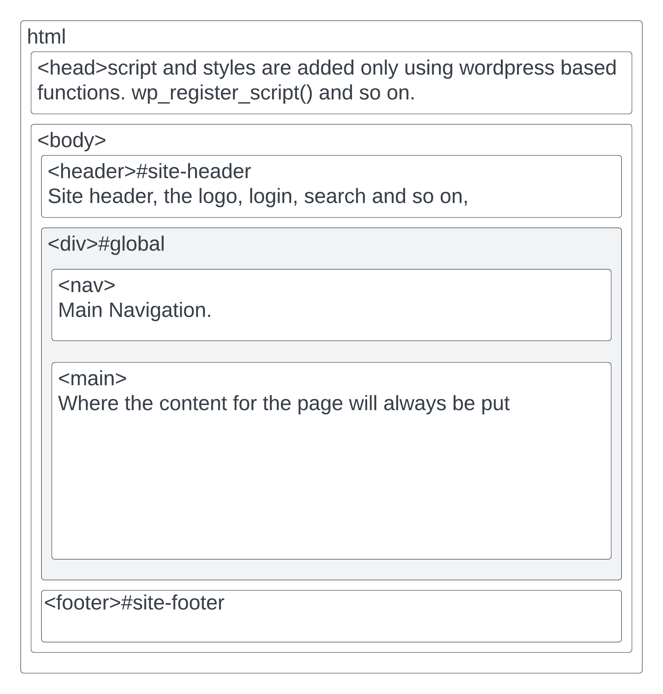

# The Warp HTMX theme

This theme is setup to achieve 5 primary goals.

1. Use Tailwind CSS and not standard WordPress CSS, in an easily updatable format.
2. Is extreemly fast as it does not need to load additional CSS assests.
3. Setup so that Warp HTMX gateway can be used.
4. Lays the ground work for a Content Security Policy (CSP) that can be 100% enforced.
5. Does not use inline styles or javascript, thus can prevent inserts into the HTML that do not have CSP nonces
6. Fully supports WooCommerce. 

## Understanding the theme
The theme has only 1 file for templating, the **```index.php```**. It calls the ```get_header()``` and the ```get_footer()```, plus in the middle loads the **```template_parts/router.php```**. On purpose it does nothing else.

### Why ```template_parts/router.php``` ?
It has been setup this way so that the ```router.php``` can be called from a AJAX request to perform the templating choices. As long as the **```global $wp_query```** exists, which it always should, it can directly use that. The WARP HTMX gateway allows for this, and makes every request a main query.

Doing this will automatically load everything inside the #global div (main menu + page content).

If the only the items inside main are needed the programmer using the HTMX gateway can choose to replace the **```<main>```** with the page content only. More on all of this insde the HTMX gateway documentation.  Just know that its all be setup to re-use the ```template_parts``` as much as possible. A good attempt at DRY coding, and reducing the time to market for a new website.

### WooCommerce support
All of the ```woocommerce``` directory template files have been adjusted for 2 things. To only use Tailwind CSS for styling, and to have zero inline scripts or styles.  **This is opposite to whatever has been done for WooCommerce before**. All of the existing classes have been left in place where possible so that 3rd party products can still reference them in their JS or CSS, but the standard WooCommerce CSS is not loaded.

The theme is based on https://tailwindui.com/ for its design. 

### ```design.json``` Single place for all styling
In the root of the theme is a file called design.json. Inside it is all of the Tailwind styling for the entire theme. Tailwind looks at this and compiles a CSS file that contains only classes uese in there, as well as any that might be in the theme's php file.  It has been setup to read both, however it is recommended to only use the ```design.json``` file. Using only the design.json file means that there is only 1 place to consider when working on the theme. 

If you are using a child theme, it will **only** load the design.json file from the child. 

To access any element in the json file from inside the PHP files, you can use dot.notation. There are 2 specific functions for this
**```warp_get_class()```** and **```warp_add_class()```**

By default ```warp_get_class()``` returns the contents of the class attribute.
```
// warp_get_class( $filter_name, $options = [] )
// example usage
$output = '<h1 class="'. warp_get_class('html.h1', ['append' => 'entry_title']) .'">'. get_the_title() .'</h1>';
echo $output;

// will create
<h1 class="text-5xl font-bold text-heading entry_title">Post Title</h1>
```


By default ```warp_add_class()``` echo's the class with its contents.
```
// warp_get_class( $filter_name, $options = [] )
// example usage
<h1 <?php warp_add_class('html.h1', ['append' => 'entry_title']) ?>><?php the_title() ?></h1>

// will create
<h1 class="text-5xl font-bold text-heading entry_title">Post Title</h1>
```
Both warp_add_class() and warp_get_class() have the same options with the only change being that one defaults to echo and the other defaults to returning
```
$options = wp_parse_args($options, 
    [
        'echo'      => false, // returns the output
        'append'    => '',
        'prepend'   => '',
        'default'   => '',
    ]
);
```

If the design.json file does not have a item requested in it, or if that entry is empty it will use the contents of ```$options['default']```

If the wanted item has children, it will look for the 'container' element to return that. Take this snippet from a design.json
```
{
    "html" : {
        "h1" : {
            "container" : "text-5xl font-bold text-heading",
            "a" : "underline hover:bg-white"
        }
    }
}
```
```warp_get_class('html.h1')``` would return ```text-5xl font-bold text-heading```

```warp_get_class('html.h1.a')``` would return ```underline hover:bg-white```

## Other Theme Functions
In addition to the styling via the design.json file, there is also the function ```warp_link()``` 

```warp_link($permalink, $content = '', $htmx_request = '', $attributes = []) ```

```
$permalink is the url

$content is the text or html that will appear in the link

$htmx_request is the actual request run.  it is relative to the /warp/htmx/ directory

$attributes = wp_parse_args($attributes, 
    [
        'class' => warp_get_class('html.a'),
        'hx-push-url' => esc_url($permalink),
        'method' =>  'get',
        'echo' => true
    ]
);
```
example usage could be

```
warp_link(get_permalink(get_the_ID()), 'read more' ,'post?id='.get_the_ID(), ['hx-target' => '#global']);

// would create
<a class="text-slate-600" hx-push-url="/blog/article-name/" hx-target="#main" href="http://sitename.com/blog/article-name/" hx-get="/warp/htmx/post?id=158">read more</a> 
```
If the htmx script is not loaded, it will contiune to go to the href location. However if it is, it will retrieve the content from the ```hx-get="/warp/htmx/post?id=158"``` endpoint and replace ```#global```'s content with the response, and update the url with the content of ```hx-push-url="/blog/article-name/"```, making it look like it has performed exactly the same as the standard link but with less processing needed, and a whole lot less hassle to do than the WordPress standard Ajax, JSON API or GraphQL call.

The main menu has already been setup with these links.

## Pictorial overview of the layout


## Working with Child themes
Perform the standard 

## Configuring Tailwind for development

Tailwind was setup in this manner https://medium.com/@3sd.code/how-to-install-tailwind-cli-9a53dceef571
More information about TailwindCSS CLI install here https://tailwindcss.com/blog/standalone-cli

When you have installed this, the WATCH and BUILD commands in the packagage.json will work
```
npm run tailwind:watch
```
The build command also minifies the output
```
npm run tailwind:watch
```

## Developer FAQ

1. None of the design styles from the design.json are working, nothing is going right with warp_add_class(), what should I do?

Make sure that the formatting of the warp.json is perfect.  No extra commas or whatever. If the file is not perfectly formatted then it will not be able to be read by php, thus no data is returned.

2. I want to contribute to this theme and its development.

Just make a PR via GitHub, it will be reviewed for code quality and suitablity. If it is felt that it breaks away from the core goals of this theme, you will be encouraged to make it a child theme component that anyone can easily add. Either way, your contribution will be valued. 

3. How to I make changes to the styling of the theme?

There is a design.json file in the root of the theme. Tailwind uses this to generate the CSS that it needs. Any adaptions to this will change the design accoss the site without the need to adapt any php or html. A 'single ring to rule them all' approach. this is done on purpose so that in future a UI kit generator like [Skeleton UI](https://www.skeleton.dev/docs/generator) can be supported. 

Just remember to run ```npm run tailwind:build``` or tailwind:watch after making changes to the design.json to see them refeclted on screen.

4. How do I make sure my changes stick?

**Always** use a child theme.  This will override the parent theme for whatever files you choose to use and adapt.